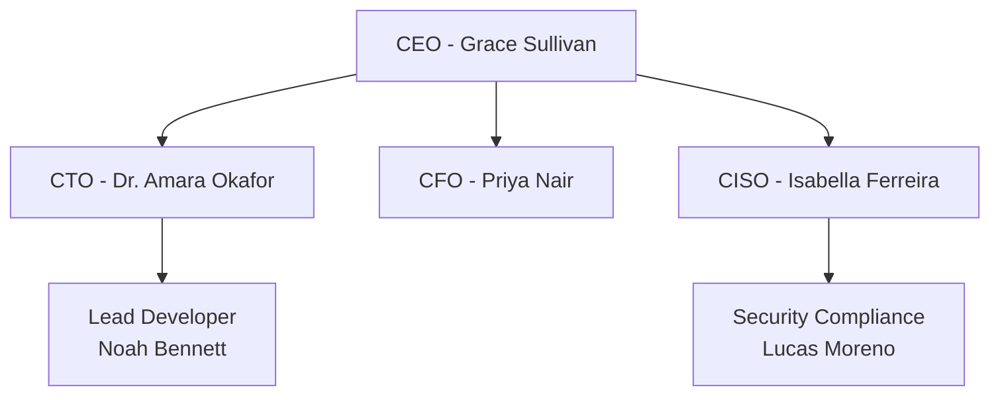

## Public Information
This section is available to everyone immediately upon accessing the site.

### Company Overview
Tessera is a leading cloud services provider based in Perth, Australia. We serve over 150 SME clients with comprehensive cloud infrastructure management, cybersecurity services, and compliance consulting.

### Our Services
- Cloud Infrastructure Management
- Managed Security Services (SOC)
- Data Backup and Disaster Recovery
- Compliance Consulting (ISO 27001, NIST, Essential 8)

---

<div data-access="consultant">

## Consultant Access Documentation
*This section is available based on your unit's schedule*

### Security Policies

#### Information Security Policy (IS-POL-001)
**Version:** 3.0  
**Last Updated:** March 2023  
**Approved by:** Board of Directors

This policy establishes the framework for protecting Tessera' information assets.

**Key Requirements:**
- Annual security awareness training for all staff
- Multi-factor authentication for administrative access
- 90-day password rotation
- Immediate incident reporting

#### Access Control Policy (IS-POL-002)
**Version:** 2.1  
**Last Updated:** January 2022  
**Status:** Under Review

Defines requirements for logical and physical access control.

### Risk Assessment Summary

| Risk Category | Current Rating | Target Rating |
|--------------|----------------|---------------|
| Data Breach | High | Medium |
| Ransomware | High | Low |
| Insider Threat | Medium | Low |
| Third Party | Medium | Low |
| Physical Security | Low | Low |

### Organizational Chart



</div>

---

<div data-access="auditor">

## Full Audit Evidence
*This section requires full audit access*

### 🚨 Critical Audit Findings

#### Finding #1: Password Policy Not Enforced
Despite IS-POL-001 requiring complex passwords with 90-day rotation:

**System Configuration Evidence:**
```
Password Complexity: DISABLED
Maximum Password Age: UNLIMITED
Minimum Password Length: 6 characters
```

**Sample from password_age_report.csv:**
```csv
Username,Password_Last_Changed,Days_Old
CEO,2023-01-15,847
CFO,2023-06-01,623
Admin,2022-01-01,1095
```

#### Finding #2: Unreported Data Breach

**Internal Email Thread (March 2024):**
```
From: security@tessera.io
To: ciso@tessera.io
Date: March 14, 2024 23:47
Subject: URGENT: Detected breach

We've detected unauthorized access to customer database.
Approximately 10,000 records accessed. Attacker left ransom note.

---

From: ceo@tessera.io
To: ciso@tessera.io  
Date: March 15, 2024 09:30
Subject: Re: URGENT: Detected breach

Pay them quietly. We can't afford the reputation damage
right now with the new enterprise clients. Tell no one.
```

#### Finding #3: Backup System Failure

**Backup System Status:**
- Last Successful Backup: 47 days ago
- Backup Test Last Performed: June 2022
- Current Storage Utilization: 98% (CRITICAL)
- Estimated Recovery Time: UNKNOWN

### Employee Interview Evidence

**Interview Transcript: IT Manager (Vikram Reddy)**
```
Q: How often are security patches applied?
A: "We try to do it monthly, but honestly we're 
   about 3 months behind. The CEO doesn't want 
   downtime during business hours."

Q: What about the password policy?
A: "We had to disable it. Too many complaints 
   from executives. The CEO's password is still 
   'Tessera123' I think."
```

### System Vulnerability Scan Results

| System | Critical | High | Medium | Low |
|--------|----------|------|--------|-----|
| Web Server | 3 | 7 | 15 | 42 |
| Database | 5 | 12 | 8 | 31 |
| Firewall | 1 | 3 | 6 | 18 |
| Email Server | 2 | 9 | 11 | 25 |

**Critical Vulnerabilities Include:**
- SQL Injection in customer portal
- Unpatched RCE vulnerability (CVE-2024-1234)
- Default credentials on database server
- Open RDP to internet (port 3389)

</div>

---

## Access Information

Your access level is indicated in the top-right corner of the page. Content availability depends on:
1. Your unit password
2. The current date
3. Your unit's release schedule

### Unit Schedules

| Unit | Consultant Access | Full Audit Access |
|------|------------------|-------------------|
| ISYS6018 - Information Security Audit and Control | Week 2 (July 29) | Week 9 (Sept 16) |
| ISYS2002 - Systems Analysis and Design | Week 3 (Aug 5) | Week 10 (Sept 23) |
| ISYS6014 - Knowledge Management and Intelligent Systems | Week 4 (Aug 12) | Week 12 (Oct 7) |
| ISAD5001 - Information Systems Analysis and Design | Week 3 (Aug 5) | Week 10 (Sept 23) |

To change your unit password, click on the access indicator and confirm.