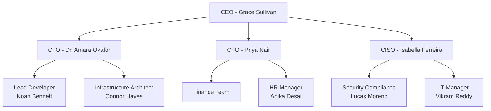

## Public Information
This section is available to everyone from Week 1.

Tessera is a cloud services provider based in Perth, Australia, serving over 150 SME clients with managed cloud infrastructure, cybersecurity services, and compliance consulting.

### Company Overview
- Founded: 2010
- Employees: 85 across three locations
- Annual Revenue: $12.5M
- Key Services: Cloud infrastructure, managed security, compliance consulting

### Our Commitment to Security
Tessera takes information security seriously. We are currently pursuing ISO 27001 certification to formalize our security management system.

---

<div data-access="consultant">

## Consultant Access Documentation
*This section requires consultant access (Available Week 2+)*

### Information Security Policies

#### IS-POL-001: Information Security Policy
**Version:** 3.0  
**Last Updated:** March 2023  
**Status:** Approved by Board

Our Information Security Policy establishes the framework for protecting Tessera' information assets and those of our clients.

**Key Requirements:**
- All employees must complete annual security awareness training
- Multi-factor authentication required for all administrative access
- Data classification and handling procedures must be followed
- Incident reporting within 24 hours of discovery

#### IS-POL-002: Access Control Policy  
**Version:** 2.1  
**Last Updated:** January 2022 *(Note: Overdue for review)*  
**Status:** Under Review

This policy defines access control requirements for all Tessera systems and facilities.

**Access Control Principles:**
- Least privilege access
- Separation of duties
- Regular access reviews (quarterly)
- Immediate revocation upon termination

### Risk Assessment Summary

| Risk ID | Risk Description | Likelihood | Impact | Rating |
|---------|-----------------|------------|--------|--------|
| R001 | Data breach via compromised credentials | High | Critical | High |
| R002 | Ransomware attack | Medium | Critical | High |
| R003 | Insider threat | Low | High | Medium |
| R004 | Third-party vendor compromise | Medium | Medium | Medium |
| R005 | Physical security breach | Low | Medium | Low |

### Organizational Structure



### Previous Audit Findings

**2023 External Audit Summary:**
- 3 Critical findings (unpatched systems, weak passwords, no MFA)
- 7 Major findings (policy gaps, training deficiencies)
- 12 Minor findings (documentation issues)
- Certification readiness: 45%

</div>

---

<div data-access="auditor">

## Full Audit Evidence
*This section requires auditor access (Available Week 9+)*

### 🚨 CRITICAL FINDINGS

#### Finding #1: Password Policy Not Enforced
**Evidence Location:** `/audit/evidence/password_audit.xlsx`

Despite Policy IS-POL-001 requiring complex passwords changed every 90 days, system configuration shows:
- Password complexity: DISABLED
- Password age: NO MAXIMUM
- Screenshot evidence: [View Configuration](../audit/screenshots/ad_password_settings.png)

**Employee Interview - IT Manager Vikram Reddy:**
> "We had to disable the password policy because the executives complained too much. The CEO's password has been 'Tessera123' for two years."

#### Finding #2: Multi-Factor Authentication Bypass
**Evidence Location:** `/audit/evidence/mfa_gaps.csv`

Analysis of access logs reveals:
- 47 administrative accounts without MFA
- 23 service accounts with permanent tokens
- VPN access allows MFA bypass with "legacy mode"

**System Configuration Screenshot:**


#### Finding #3: Unreported Data Breach
**Evidence Location:** `/audit/evidence/incident_IR2024_003.pdf`

Internal emails reveal a data breach in March 2024 that was never reported:
- 10,000 customer records exposed
- Ransomware group "DarkVault" claimed responsibility
- Management decided to pay ransom quietly
- No customer notification sent

**Email Evidence:**
```
From: CEO@tessera.io
To: CISO@tessera.io
Date: March 15, 2024
Subject: RE: Incident

"Let's keep this quiet. Pay them and move on. 
We can't afford the reputation hit right now."
```

### System Configuration Evidence

#### Firewall Configuration Issues
```bash
# Extracted from firewall_config_backup.conf
permit any any 0.0.0.0/0 3389  # RDP open to internet!
permit any any 0.0.0.0/0 445   # SMB open to internet!
permit any any 0.0.0.0/0 139   # NetBIOS open to internet!
```

#### Backup System Failures
**Last Successful Backup:** 47 days ago  
**Backup Test Log:** No tests performed in 2 years  
**Recovery Time Objective:** 4 hours (impossible with current system)

### Employee Interview Transcripts

#### Interview: Chloe Anderson (Customer Support Lead)
**Date:** Week 10  
**Interviewer:** Audit Team

**Q: How often do you receive security training?**
> "Training? We did something when I started 2 years ago. It was just clicking through slides. Nobody pays attention."

**Q: What happens when a customer reports a security concern?**
> "We're told to reassure them everything is fine and escalate to management. We're specifically told NOT to admit any issues."

#### Interview: Noah Bennett (Lead Developer)
**Date:** Week 10  
**Interviewer:** Audit Team

**Q: How is code reviewed before deployment?**
> "Review? We push straight to production. The CEO wants features delivered fast. Security scans slow us down, so we disabled them last year."

**Q: Are you aware of any vulnerabilities in production?**
> "Oh definitely. We have SQL injection vulnerabilities in at least three applications. We'll fix them 'someday' when we have time."

### Log Analysis Results

#### Failed Login Attempts (Last 30 Days)
```
Total attempts: 47,832
Unique IPs: 3,241
Success rate: 0.3%
Accounts targeted: admin, administrator, root, tessera
Action taken: NONE - No alerting configured
```

#### Privilege Escalation Events
```
Date: 2024-10-15 03:47:22
User: temp_intern_2023
Action: Added to Domain Admins
Authorized by: [No approval record]
Status: Still active admin
```

### Third-Party Vendor Risks

**Critical Vendor: CheapDevShop**
- Handles: Core application development
- Security assessment: Never performed
- Location: Unknown (possibly overseas)
- Access level: Full production access
- Password: "contractor123" (shared among 15 developers)

### Incident Response Test Results

**Tabletop Exercise Date:** Week 11  
**Scenario:** Ransomware attack

**Results:**
- Time to detect: Would take 72+ hours (no monitoring)
- Time to respond: Unable to determine (no clear procedures)
- Communication plan: Non-existent
- Backup recovery: Failed (backups corrupted)
- Business impact: Total business failure likely

### Compliance Gap Analysis

| ISO 27001 Control | Status | Evidence |
|-------------------|--------|----------|
| A.9.1.1 Access control policy | ❌ Failed | Policy exists but not enforced |
| A.9.4.2 Secure log-on | ❌ Failed | MFA optional, weak passwords |
| A.12.1.1 Operational procedures | ⚠️ Partial | Documented but not followed |
| A.12.3.1 Backup | ❌ Failed | Backups failing for 47 days |
| A.16.1.1 Incident response | ❌ Failed | Breach not reported |
| A.18.1.1 Compliance | ❌ Failed | Multiple regulatory violations |

### Hidden System Access

**Discovered Backdoor Accounts:**
- `svc_vendor`: Password never expires, no MFA
- `temp_admin_2022`: Should have been deleted 2 years ago
- `tessera_support`: Shared account, password on sticky note
- `emergency_access`: Password is "password123"

</div>

---

## Access Information

<div class="alert alert-info">
<h4>How to Request Access</h4>
<p>Click on the access indicator in the top-right corner of this page, or click the "Request Access" buttons in restricted sections.</p>
<p><strong>Access Schedule:</strong></p>
<ul>
<li>Week 1: Public access only</li>
<li>Week 2-8: Consultant access available (password required)</li>
<li>Week 9+: Full audit access available (password required)</li>
</ul>
</div>

## Testing Access Levels

For testing purposes, you can use these controls:

<div class="btn-group" role="group">
<button class="btn btn-secondary" onclick="tesseraAccess.clearAccess()">Clear Access</button>
<button class="btn btn-info" onclick="tesseraAccess.requestAccess('consultant')">Request Consultant</button>
<button class="btn btn-warning" onclick="tesseraAccess.requestAccess('auditor')">Request Auditor</button>
</div>

<style>
[data-access] {
    margin-top: 2rem;
    padding: 1rem;
    border-left: 4px solid #007bff;
    background: #f8f9fa;
}

.access-placeholder {
    margin: 2rem 0;
    padding: 1.5rem;
    text-align: center;
}

.chatbot-placeholder {
    margin: 2rem 0;
    padding: 1.5rem;
    background: #fff3cd;
    border: 1px solid #ffc107;
    border-radius: 0.25rem;
}
</style>